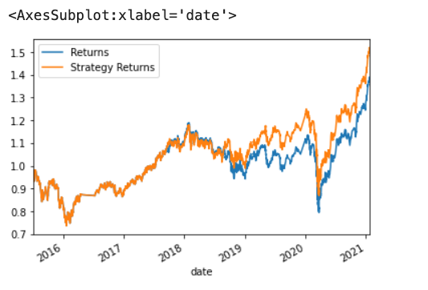
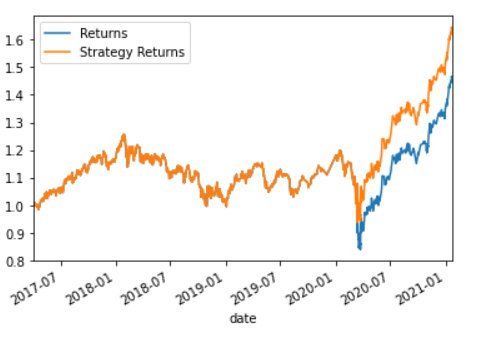
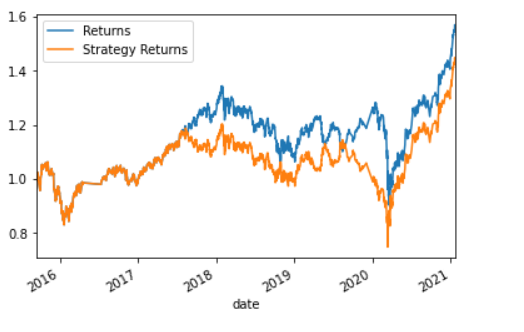
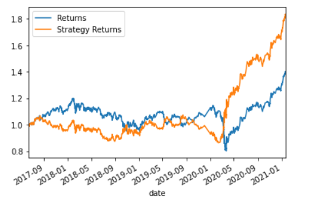
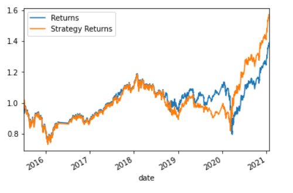

# Machine Learning Trading Bot - Report


  
`Algorithmic trading` enhance the existing trading signals with machine learning algorithms that can adapt to new data.

[CLICK HERE](https://www.investopedia.com/articles/active-trading/101014/basics-algorithmic-trading-concepts-and-examples.asp) to learn more about Algorithmic trading

Evaluation Report

Actual Returns vs. SVC Model Returns

### Short 4, Long 100, DateOffset 3 months


```python
short_window = 4
long_window = 100
DateOffset = 3 months
```


SVC model outperformed slightly (SVC 1.52 vs actual 1.386)



---

##Actual Returns vs. Tuned ML Bot Returns


### Step 1: Short 4, Long 100, DateOffset 24 months


```python
short_window = 4
long_window = 100
DateOffset = 24 months
```


)


increasing the training window imporved the performance of the model.  


### Step 2: Short 50, Long 200, DateOffset 3 Months


```python
short_window = 50
long_window = 200
DateOffset = 3 months
```




SVM strategy underperformed 

### Step 3: Short 50, Long 200, DateOffset 24 Months


```python
short_window = 50
long_window = 200
DateOffset = 24 months
```




Moden performed well given longer window 

---

## Analysis of Actual Returns vs. AdaBoost Returns

The original parameters, as seen below, were evaluated using the AdaBoost Classifier model.

```python
short_window = 4
long_window = 100
DateOffset = 3 months
```




 AdaBoost Classifier outperforma SVC model for long-short algorithm trading strategy

---


